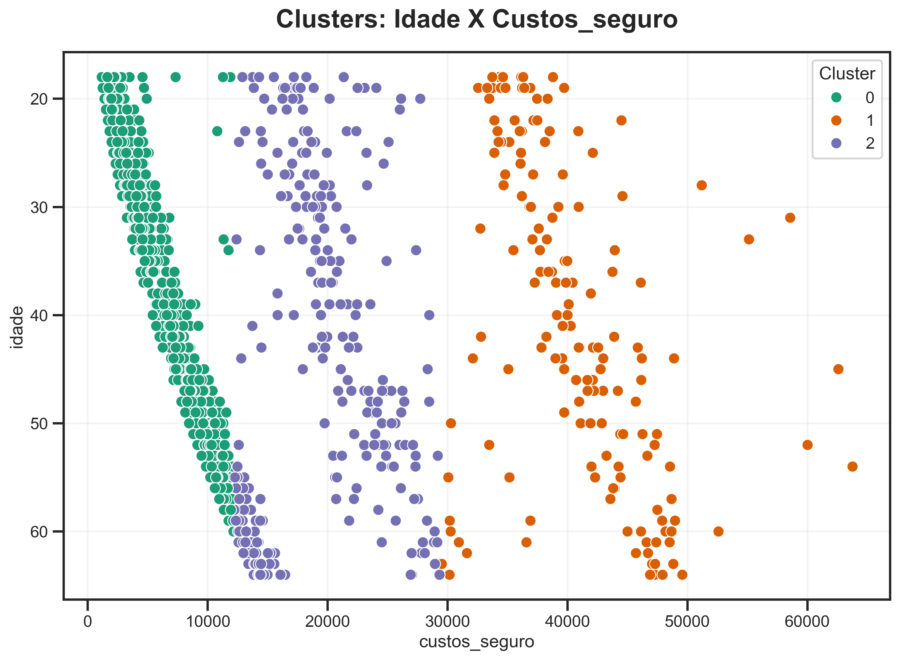

# Clustering de Dados de Custo de Seguros

## Descrição do Projeto
Este projeto aplica técnicas de clusterização para identificar padrões nos custos de seguros de saúde com base em dados demográficos e comportamentais. Utilizando o algoritmo K-Prototypes, conseguimos agrupar indivíduos levando em consideração variáveis numéricas e categóricas.

## Objetivo
Identificar grupos homogêneos de indivíduos para:
- Entender os principais fatores que influenciam o custo do seguro.
- Auxiliar na criação de políticas personalizadas de seguros.
- Gerar insights para otimizar a precificação dos planos de saúde.

## Dados
O dataset utilizado contém informações demográficas, comportamentais e financeiras relacionadas a indivíduos e seus custos de seguros de saúde. As colunas principais são:

- **idade**: Idade do indivíduo.
- **sexo**: Gênero (male ou female).
- **imc**: Índice de Massa Corporal.
- **quantidade_filhos**: Número de filhos dependentes.
- **fumante**: Indica se é fumante (yes ou no).
- **regiao**: Região geográfica (northwest, southwest, southeast, northeast).
- **custos_seguro**: Custo do seguro de saúde.

## Metodologia
O projeto seguiu as etapas abaixo:

### 1. **Exploração e Limpeza de Dados**
- Análise exploratória dos dados para identificar distribuições, outliers e correlações.
- Tratamento de valores faltantes e transformações necessárias.

### 2. **Pré-processamento**
- Codificação de variáveis categóricas para uso no modelo K-Prototypes.

### 3. **Clusterização**
- Implementação do algoritmo K-Prototypes para lidar com dados mistos.
- Determinação do número ótimo de clusters.

### 4. **Visualização e Interpretação**
- Visualização dos clusters em gráficos 2D utilizando `seaborn` e `plotly`.
- Análise dos perfis de cada cluster.

## Ferramentas e Tecnologias
- **Linguagem**: Python
- **Bibliotecas Principais**:
  - `pandas`, `numpy`: Manipulação e análise de dados.
  - `matplotlib`, `seaborn`, `plotly`: Visualizações.
  - `kmodes.kprototypes`: Algoritmo de clusterização para dados mistos.

## Resultados
- Foram identificados grupos com características distintas baseados em idade, IMC, região, e hábitos de fumo.
- Os clusters mostraram-se úteis para explicar variações nos custos de seguros.

Abaixo está a visualização dos clusters identificados:




## Como Reproduzir
1. Clone este repositório:
   ```bash
   git clone https://github.com/AurelioGuilherme/DNC_projetos.git
   ```
2. Instale as dependências listadas no arquivo `requirements.txt`:
   ```bash
   pip install -r requirements.txt
   ```
3. Execute o notebook `Clustering_project.ipynb` para reproduzir as análises e resultados.

## Contribuições
Sugestões e melhorias são bem-vindas! Envie um pull request ou entre em contato através da aba de Issues.

